<!-- showcase:start -->

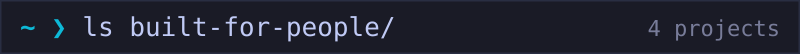

<a href="https://domocuisto.com">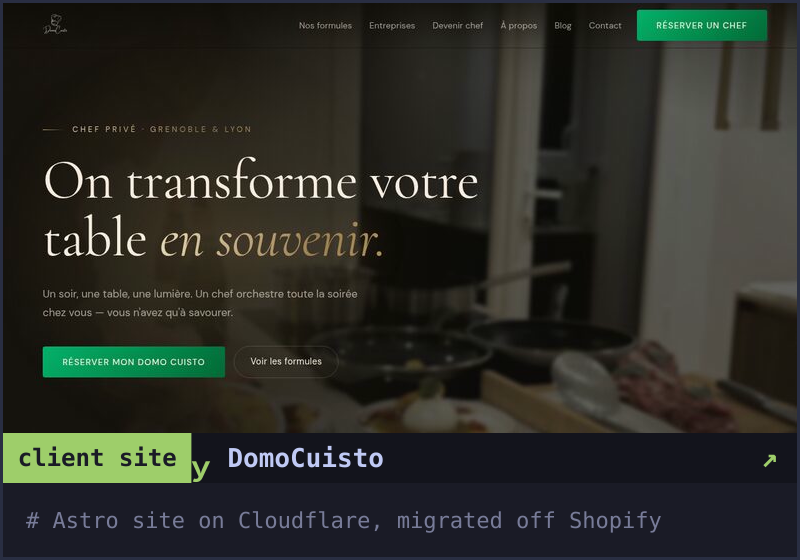</a>
<a href="https://bengous.github.io/petit-manege-classe/">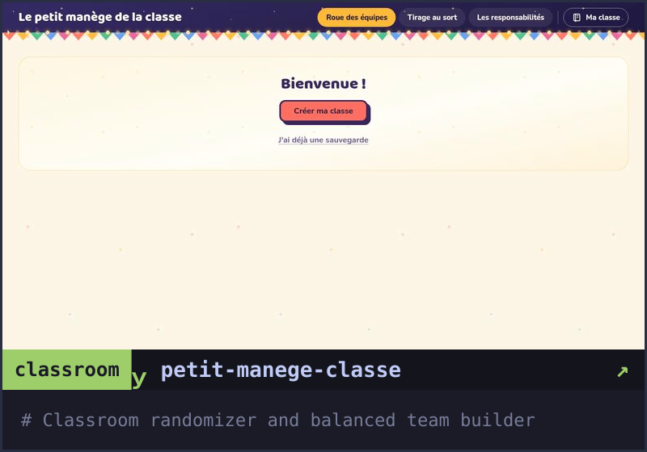</a>

<a href="https://github.com/bengous/ambiens">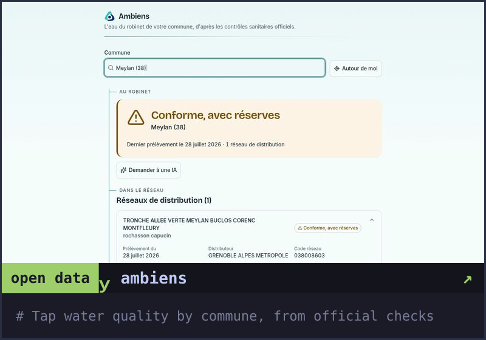</a>
<a href="https://bengous.github.io/git-image-par-image/">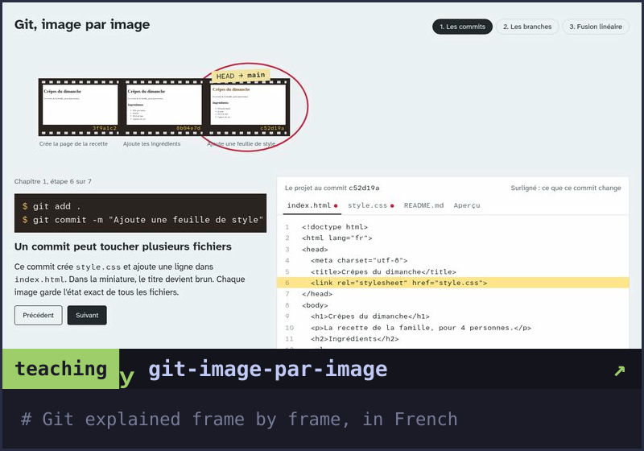</a>

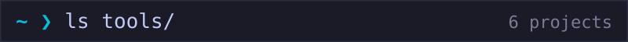

<a href="https://github.com/bengous/claude-code-plugins">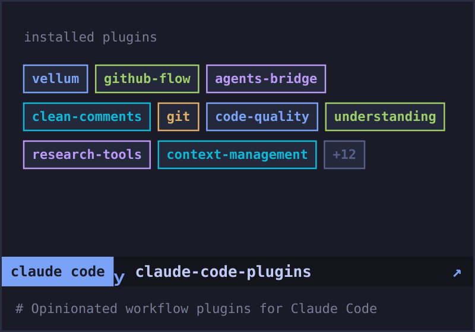</a>
<a href="https://github.com/bengous/ccgateways">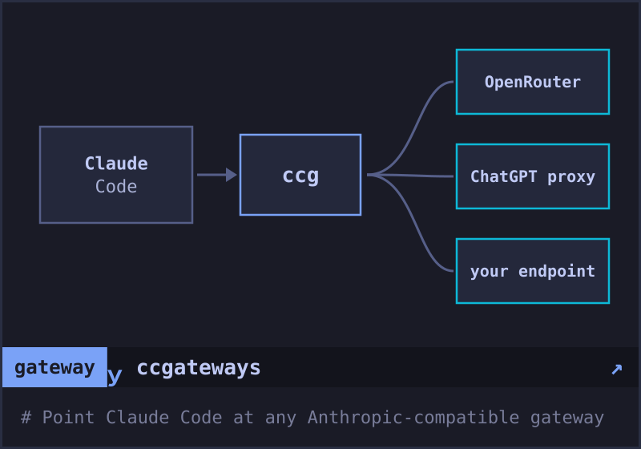</a>

<a href="https://github.com/bengous/codex-path-rules">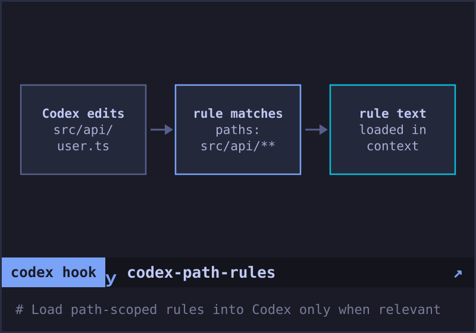</a>
<a href="https://github.com/bengous/vex">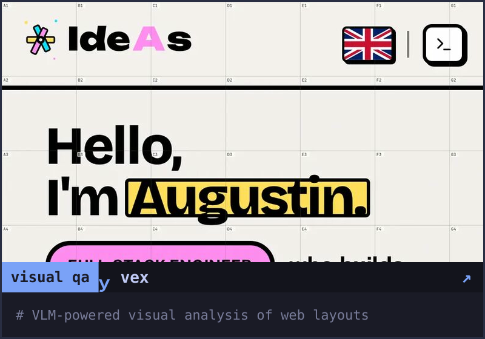</a>

<a href="https://github.com/bengous/agent-notifier-omarchy">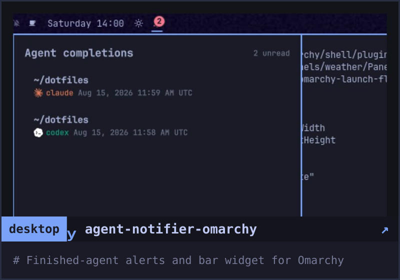</a>
<a href="https://github.com/bengous/prompt-context-router">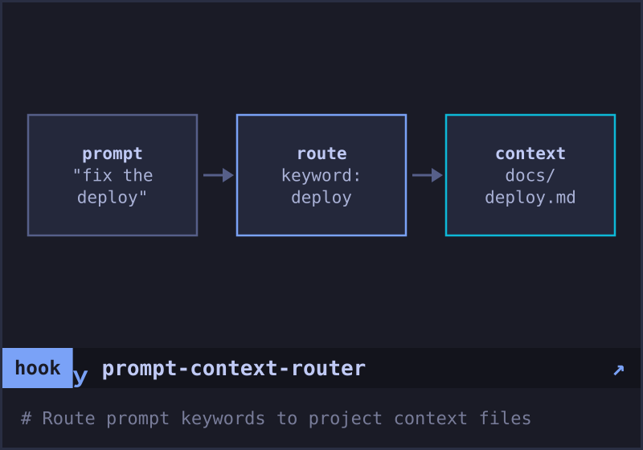</a>

<a href="https://github.com/bengous/oxcraft">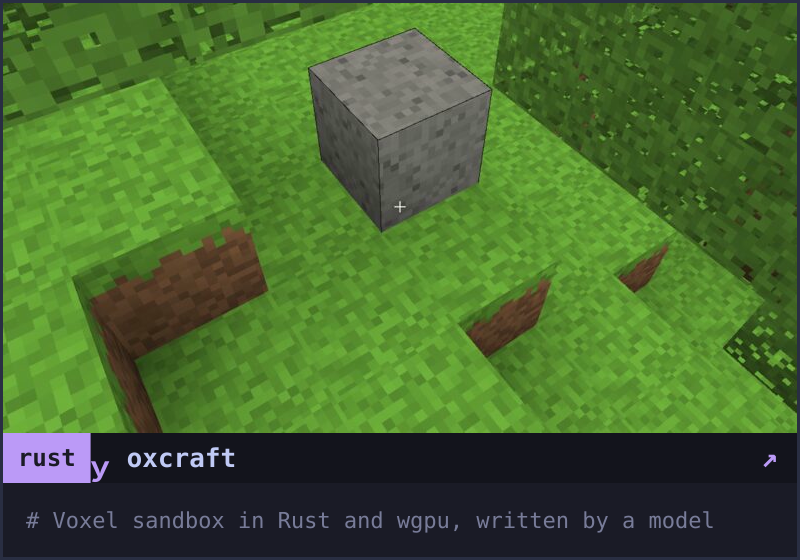</a>
<a href="https://bengous.github.io/pepin/">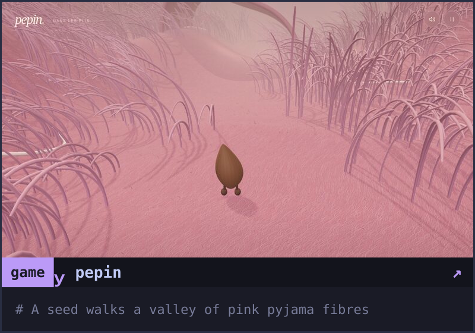</a>

<a href="https://bengous.github.io/cap/">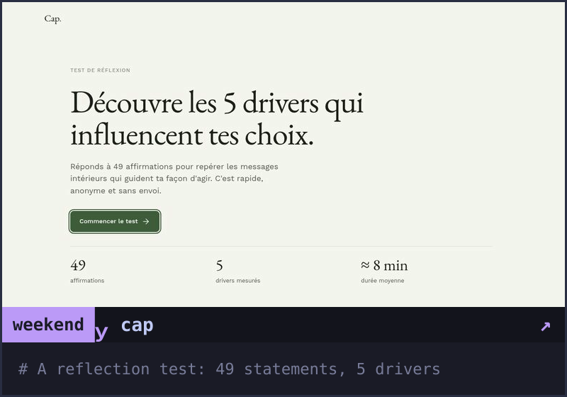</a>
<a href="https://bengous.github.io/IdeAs/">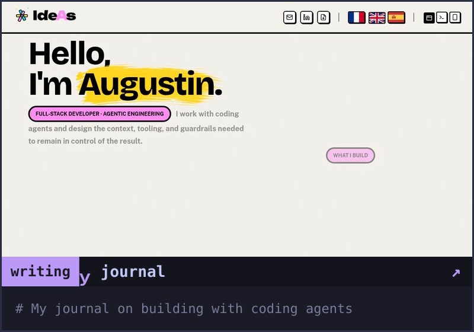</a>

<!-- showcase:end -->

<b>ls -a</b> · everything else, school projects included

<pre>
$ bengous ls tools            # things I built to use
<a href="https://github.com/bengous/agents-skills">agents-skills</a>                 Custom skills for Claude Code agents <!-- profile: priority=70 -->
<a href="https://github.com/bengous/wireframer">wireframer</a>                    Inject into pages, export DOM as wireframe <!-- profile: priority=60 -->
<a href="https://github.com/bengous/hex-validator">hex-validator</a>                 Architecture validator for hexagonal TypeScript <!-- profile: priority=50 -->
<a href="https://github.com/bengous/custom-scripts">custom-scripts</a>                Venv and shell helpers for dev machines <!-- profile: priority=40 -->
<a href="https://github.com/bengous/scripts-and-snippets">scripts-and-snippets</a>          Small standalone scripts, one problem each
<a href="https://github.com/bengous/adv360">adv360</a>                        Native Linux editor for the Kinesis Advantage360
<a href="https://github.com/bengous/kitsmith">kitsmith</a>                      Opinionated Bun project scaffolder (archived, lives on in runweaver)
<a href="https://github.com/bengous/npm-supply-exposure">npm-supply-exposure</a>           Scan for traces of compromised npm packages
<a href="https://github.com/bengous/runweaver">runweaver</a>                     Declare quality tooling once for agent hooks, Git hooks, CI, and CLIs
<a href="https://github.com/bengous/multireports-end2end-helper">multireports-end2end-helper</a>   Java 21 E2E test framework, TestNG + Allure
<a href="https://github.com/bengous/agent-visitor">agent-visitor</a>                 Walk a codebase, emit per-directory YAML
<a href="https://github.com/bengous/claude-to-codex-session">claude-to-codex-session</a>       Import Claude Code transcripts into Codex sessions (archived)
<a href="https://github.com/bengous/productivity-tracking">productivity-tracking</a>         Git-backed task manager with calendar sync
<a href="https://github.com/bengous/whisperer">whisperer</a>                     Local-first audio and video transcription with Whisper
<a href="https://github.com/bengous/agentlink">agentlink</a>                     Audit and migrate agent instruction files across repos
<a href="https://github.com/bengous/bookmarker">bookmarker</a>                    Compare and sync bookmarks across browsers
<a href="https://github.com/bengous/claude-hooks">claude-hooks</a>                  Hooks for Claude Code event lifecycle
<a href="https://github.com/bengous/draft-flow-refine">draft-flow-refine</a>             Photoshoot draft review workflow UI (archived)
<a href="https://github.com/bengous/hookjson">hookjson</a>                      Wrap any command, emit NDJSON for AI agents

$ bengous ls experiments      # things I built to learn
<a href="https://github.com/bengous/ai-context-layers">ai-context-layers</a>             Layered context engineering for AI assistants <!-- profile: priority=100 -->
<a href="https://github.com/bengous/docaudit">docaudit</a>                      Audit documents with Claude, rewrite as PDF <!-- profile: priority=90 -->
<a href="https://github.com/bengous/circuito-combinacion">circuito-combinacion</a>          Few-prompt circuit demo for a veteran electrician
<a href="https://github.com/bengous/d2r-manager">d2r-manager</a>                   Rust case study: Diablo II save migration and stash merges
<a href="https://github.com/bengous/effect-visual-tutor">effect-visual-tutor</a>           Interactive visual lessons for code and architecture
<a href="https://github.com/bengous/explorador-genealogia-bengolea">explorador-genealogia</a>         Interactive family tree explorer, in Spanish
<a href="https://github.com/bengous/potabilis">potabilis</a>                     Local Bun prototype behind ambiens, parses official thresholds
<a href="https://github.com/bengous/go-htmx-todo">go-htmx-todo</a>                  Todo app with Go stdlib, htmx, and SQLite
<a href="https://github.com/bengous/pharmock">pharmock</a>                      Static pharmacy site (Meylan, France)
<a href="https://github.com/bengous/rust-buildsaver">rust-buildsaver</a>               Copy build artifacts to versioned paths
<a href="https://github.com/bengous/nextjs-galerie-template">nextjs-galerie-template</a>       EXIF photo blog with upload and tagging
<a href="https://github.com/bengous/go-httpclient">go-httpclient</a>                 Web HTTP client with SQLite persistence
<a href="https://github.com/bengous/rust-game-of-conway">rust-game-of-conway</a>           Conway's Game of Life with Piston rendering
<a href="https://github.com/bengous/csv-merge-edu">csv-merge-edu</a>                 Merge French school CSVs + Maps links

$ bengous ls school           # things I built because I had to
<a href="https://github.com/bengous/MindstormLeagueDecision">MindstormLeagueDecision</a>       PDDL planner for Lego Mindstorm robot
<a href="https://github.com/bengous/introdistributedsystems">introdistributedsystems</a>       RMI-based distributed chat service
<a href="https://github.com/bengous/tli-downloader">tli-downloader</a>                JavaFX concurrent file downloader
<a href="https://github.com/bengous/cosmopolitan">cosmopolitan</a>                  MinCaml-to-ARM compiler, full pipeline
<a href="https://github.com/bengous/SocialBuddies">SocialBuddies</a>                 Distributed social network over Java RMI
<a href="https://github.com/bengous/mincaml-compiler">mincaml-compiler</a>              MinCaml compiler frontend: parser, visitors
<a href="https://github.com/bengous/SabikeMockups">SabikeMockups</a>                 Angular Material UI mockups for Sabike
<a href="https://github.com/bengous/Sabike">Sabike</a>                        Bike e-commerce (JHipster/Spring/Angular)
<a href="https://github.com/bengous/SocialBuddiesMaven">SocialBuddiesMaven</a>            SocialBuddies repackaged with Maven
<a href="https://github.com/bengous/IonicFirebaseToutdoux">IonicFirebaseToutdoux</a>         Todo list app with Firebase sync
<a href="https://github.com/bengous/DevOpsPandasS">DevOpsPandasS</a>                 Maven + CircleCI pipeline scaffold
<a href="https://github.com/bengous/Javaneeese">Javaneeese</a>                    Distributed shared objects with locking
<a href="https://github.com/bengous/IDS">IDS</a>                           Socket echo server and calculator exercises
<a href="https://github.com/bengous/patia">patia</a>                         JavaFX point stream visualizer
<a href="https://github.com/bengous/prime-courses">prime-courses</a>                 Daily kata generator for algorithms <!-- profile: priority=-100 -->
<a href="https://github.com/bengous/AdventOfCode2023">AdventOfCode2023</a>              AoC 2023 solutions, days 1-12 <!-- profile: priority=-110 -->
<a href="https://github.com/bengous/AdventOfCode2022">AdventOfCode2022</a>              AoC 2022 solutions, days 1-4 <!-- profile: priority=-120 -->

$ bengous ls collabs          # things I built for others
<a href="https://github.com/bengous/jukebox">jukebox</a>                       Next.js + Strapi with Spotify integration
<a href="https://guigpap.github.io/CV/">guigpap/CV</a>                    Terminal-style portfolio, design + code
<a href="https://benjamin-rouanet.github.io/mon-cv/">benjamin-rouanet/mon-cv</a>       Horology CV site + linked educational game

</pre>

<a href="https://bengous.github.io/IdeAs/"><b>journal</b></a> · <a href="https://www.linkedin.com/in/augustinbengolea/" target="_blank" rel="noopener noreferrer"><b>linkedin</b></a>

