<pre>
<picture><source media="(prefers-color-scheme: dark)" srcset="assets/fbbf8ba4c4a7.svg"></picture>
<picture><source media="(prefers-color-scheme: dark)" srcset="assets/12761894ad33.svg"></picture>
<picture><source media="(prefers-color-scheme: dark)" srcset="assets/fcd8cb416e77.svg"></picture>
<picture><source media="(prefers-color-scheme: dark)" srcset="assets/9dbf0f7350f5.svg"></picture>

<picture><source media="(prefers-color-scheme: dark)" srcset="assets/fc76df8a42ad.svg"></picture>
<picture><source media="(prefers-color-scheme: dark)" srcset="assets/172a0ed819d1.svg"></picture>
<picture><source media="(prefers-color-scheme: dark)" srcset="assets/66f3abe42c13.svg"></picture>

<picture><source media="(prefers-color-scheme: dark)" srcset="assets/d06d3ffd1bfe.svg"></picture>
<picture><source media="(prefers-color-scheme: dark)" srcset="assets/c97c5ff1163e.svg"></picture>
<picture><source media="(prefers-color-scheme: dark)" srcset="assets/9238a118f463.svg"></picture>

<picture><source media="(prefers-color-scheme: dark)" srcset="assets/5fa7a2fc5aed.svg"></picture>
<a href="https://bengous.github.io/d2-lab/"><picture><source media="(prefers-color-scheme: dark)" srcset="assets/d683f8167eaf.svg"></picture></a>
<a href="https://github.com/bengous/adv360"><picture><source media="(prefers-color-scheme: dark)" srcset="assets/809c9c971add.svg"></picture></a>
<a href="https://github.com/bengous/claude-code-plugins"><picture><source media="(prefers-color-scheme: dark)" srcset="assets/fb2ce0d4c174.svg"></picture></a>
<a href="https://github.com/bengous/agentcraft"><picture><source media="(prefers-color-scheme: dark)" srcset="assets/f7fd88a99ed9.svg"></picture></a>
<a href="https://github.com/bengous/circuito-combinacion"><picture><source media="(prefers-color-scheme: dark)" srcset="assets/4f1c06b92ac4.svg"></picture></a>
<a href="https://github.com/bengous/caveats"><picture><source media="(prefers-color-scheme: dark)" srcset="assets/c921dc02ae6d.svg"></picture></a>
<a href="https://github.com/bengous/scripts-and-snippets"><picture><source media="(prefers-color-scheme: dark)" srcset="assets/84931df785e2.svg"></picture></a>
<a href="https://github.com/bengous/agents-skills"><picture><source media="(prefers-color-scheme: dark)" srcset="assets/90b2e71f0386.svg"></picture></a>
<a href="https://bengous.github.io/petit-manege-classe/"><picture><source media="(prefers-color-scheme: dark)" srcset="assets/1713fd0eb781.svg"></picture></a>
<a href="https://bengous.github.io/git-image-par-image/"><picture><source media="(prefers-color-scheme: dark)" srcset="assets/dafca0ecd8db.svg"></picture></a>
<a href="https://github.com/bengous/agent-notifier-omarchy"><picture><source media="(prefers-color-scheme: dark)" srcset="assets/c65f2b8922f4.svg"></picture></a>
<a href="https://bengous.github.io/pepin/"><picture><source media="(prefers-color-scheme: dark)" srcset="assets/0fb461038813.svg"></picture></a>

<picture><source media="(prefers-color-scheme: dark)" srcset="assets/c1b9b6c170d7.svg"></picture>
<a href="https://github.com/bengous/claude-code-plugins"><picture><source media="(prefers-color-scheme: dark)" srcset="assets/ecdce948156a.svg"></picture></a>
<a href="https://github.com/bengous/vex"><picture><source media="(prefers-color-scheme: dark)" srcset="assets/374cd63e9509.svg"></picture></a>
<a href="https://github.com/bengous/agents-skills"><picture><source media="(prefers-color-scheme: dark)" srcset="assets/793290da4ffa.svg"></picture></a>
<a href="https://github.com/bengous/wireframer"><picture><source media="(prefers-color-scheme: dark)" srcset="assets/b5023b436a37.svg"></picture></a>
<a href="https://github.com/bengous/hex-validator"><picture><source media="(prefers-color-scheme: dark)" srcset="assets/c3c591b420ad.svg"></picture></a>
<a href="https://github.com/bengous/custom-scripts"><picture><source media="(prefers-color-scheme: dark)" srcset="assets/8f09fa1d6751.svg"></picture></a>
<a href="https://github.com/bengous/adv360"><picture><source media="(prefers-color-scheme: dark)" srcset="assets/8b641afe583c.svg"></picture></a>
<a href="https://github.com/bengous/agent-notifier-omarchy"><picture><source media="(prefers-color-scheme: dark)" srcset="assets/7d36d4168f58.svg"></picture></a>
<a href="https://github.com/bengous/scripts-and-snippets"><picture><source media="(prefers-color-scheme: dark)" srcset="assets/0b82f3dc4618.svg"></picture></a>
<a href="https://github.com/bengous/caveats"><picture><source media="(prefers-color-scheme: dark)" srcset="assets/0eb696a224e4.svg"></picture></a>
<a href="https://github.com/bengous/kitsmith"><picture><source media="(prefers-color-scheme: dark)" srcset="assets/b1ac1ad67620.svg"></picture></a>
<a href="https://github.com/bengous/codex-path-rules"><picture><source media="(prefers-color-scheme: dark)" srcset="assets/4c171fd965d3.svg"></picture></a>
<a href="https://github.com/bengous/npm-supply-exposure"><picture><source media="(prefers-color-scheme: dark)" srcset="assets/a200fbc47978.svg"></picture></a>
<a href="https://github.com/bengous/ccgateways"><picture><source media="(prefers-color-scheme: dark)" srcset="assets/afe2a899b1e9.svg"></picture></a>
<a href="https://github.com/bengous/runweaver"><picture><source media="(prefers-color-scheme: dark)" srcset="assets/cbaff8d6708e.svg"></picture></a>
<a href="https://github.com/bengous/multireports-end2end-helper"><picture><source media="(prefers-color-scheme: dark)" srcset="assets/8613c4988fbb.svg"></picture></a>
<a href="https://github.com/bengous/agent-visitor"><picture><source media="(prefers-color-scheme: dark)" srcset="assets/26d30c986329.svg"></picture></a>
<a href="https://github.com/bengous/prompt-context-router"><picture><source media="(prefers-color-scheme: dark)" srcset="assets/d0e8f1e4efdd.svg"></picture></a>
<a href="https://github.com/bengous/claude-to-codex-session"><picture><source media="(prefers-color-scheme: dark)" srcset="assets/7095ee825023.svg"></picture></a>
<a href="https://github.com/bengous/productivity-tracking"><picture><source media="(prefers-color-scheme: dark)" srcset="assets/fcf302eb2ed2.svg"></picture></a>
<a href="https://github.com/bengous/whisperer"><picture><source media="(prefers-color-scheme: dark)" srcset="assets/084f4aa63634.svg"></picture></a>
<a href="https://github.com/bengous/agentlink"><picture><source media="(prefers-color-scheme: dark)" srcset="assets/87f4b3e7e1c2.svg"></picture></a>
<a href="https://github.com/bengous/bookmarker"><picture><source media="(prefers-color-scheme: dark)" srcset="assets/b764fd9804f9.svg"></picture></a>
<a href="https://github.com/bengous/claude-hooks"><picture><source media="(prefers-color-scheme: dark)" srcset="assets/e12123645bf0.svg"></picture></a>
<a href="https://github.com/bengous/draft-flow-refine"><picture><source media="(prefers-color-scheme: dark)" srcset="assets/93aff0186897.svg"></picture></a>
<a href="https://github.com/bengous/hookjson"><picture><source media="(prefers-color-scheme: dark)" srcset="assets/d7f4fa7afc28.svg"></picture></a>

<picture><source media="(prefers-color-scheme: dark)" srcset="assets/82a80e1ca866.svg"></picture>
<a href="https://github.com/bengous/ai-context-layers"><picture><source media="(prefers-color-scheme: dark)" srcset="assets/3bc42d425280.svg"></picture></a>
<a href="https://github.com/bengous/docaudit"><picture><source media="(prefers-color-scheme: dark)" srcset="assets/707936fa0ee4.svg"></picture></a>
<a href="https://bengous.github.io/cap/"><picture><source media="(prefers-color-scheme: dark)" srcset="assets/596a38318b07.svg"></picture></a>
<a href="https://github.com/bengous/circuito-combinacion"><picture><source media="(prefers-color-scheme: dark)" srcset="assets/8c979d6c0860.svg"></picture></a>
<a href="https://github.com/bengous/agentcraft"><picture><source media="(prefers-color-scheme: dark)" srcset="assets/f36faa512b9e.svg"></picture></a>
<a href="https://bengous.github.io/d2-lab/"><picture><source media="(prefers-color-scheme: dark)" srcset="assets/d1bc40859ee0.svg"></picture></a>
<a href="https://github.com/bengous/d2r-manager"><picture><source media="(prefers-color-scheme: dark)" srcset="assets/b8298bf64b8d.svg"></picture></a>
<a href="https://bengous.github.io/git-image-par-image/"><picture><source media="(prefers-color-scheme: dark)" srcset="assets/e6c383377fb9.svg"></picture></a>
<a href="https://github.com/bengous/ambiens"><picture><source media="(prefers-color-scheme: dark)" srcset="assets/cbb697bf7fd7.svg"></picture></a>
<a href="https://github.com/bengous/effect-visual-tutor"><picture><source media="(prefers-color-scheme: dark)" srcset="assets/18bdd2839ec5.svg"></picture></a>
<a href="https://bengous.github.io/pepin/"><picture><source media="(prefers-color-scheme: dark)" srcset="assets/b871d6523fda.svg"></picture></a>
<a href="https://github.com/bengous/explorador-genealogia-bengolea"><picture><source media="(prefers-color-scheme: dark)" srcset="assets/04b10f0a9947.svg"></picture></a>
<a href="https://github.com/bengous/potabilis"><picture><source media="(prefers-color-scheme: dark)" srcset="assets/b80291acdc2b.svg"></picture></a>
<a href="https://github.com/bengous/go-htmx-todo"><picture><source media="(prefers-color-scheme: dark)" srcset="assets/d6f471cfa6c7.svg"></picture></a>
<a href="https://github.com/bengous/pharmock"><picture><source media="(prefers-color-scheme: dark)" srcset="assets/3f83088d7d40.svg"></picture></a>
<a href="https://github.com/bengous/rust-buildsaver"><picture><source media="(prefers-color-scheme: dark)" srcset="assets/498f77f5eeb0.svg"></picture></a>
<a href="https://github.com/bengous/nextjs-galerie-template"><picture><source media="(prefers-color-scheme: dark)" srcset="assets/c35b40af2a4a.svg"></picture></a>
<a href="https://github.com/bengous/go-httpclient"><picture><source media="(prefers-color-scheme: dark)" srcset="assets/1cb5bedadabe.svg"></picture></a>
<a href="https://github.com/bengous/rust-game-of-conway"><picture><source media="(prefers-color-scheme: dark)" srcset="assets/b38aa6fbcf89.svg"></picture></a>
<a href="https://github.com/bengous/csv-merge-edu"><picture><source media="(prefers-color-scheme: dark)" srcset="assets/26d175d70054.svg"></picture></a>

<picture><source media="(prefers-color-scheme: dark)" srcset="assets/c9607f468530.svg"></picture>
<a href="https://github.com/bengous/MindstormLeagueDecision"><picture><source media="(prefers-color-scheme: dark)" srcset="assets/7ce4bbe6e443.svg"></picture></a>
<a href="https://github.com/bengous/introdistributedsystems"><picture><source media="(prefers-color-scheme: dark)" srcset="assets/a03e9095fc34.svg"></picture></a>
<a href="https://github.com/bengous/tli-downloader"><picture><source media="(prefers-color-scheme: dark)" srcset="assets/c8de0dbd8f95.svg"></picture></a>
<a href="https://github.com/bengous/cosmopolitan"><picture><source media="(prefers-color-scheme: dark)" srcset="assets/f93027dd92f1.svg"></picture></a>
<a href="https://github.com/bengous/SocialBuddies"><picture><source media="(prefers-color-scheme: dark)" srcset="assets/4fb9e1409a29.svg"></picture></a>
<a href="https://github.com/bengous/mincaml-compiler"><picture><source media="(prefers-color-scheme: dark)" srcset="assets/805336a30d97.svg"></picture></a>
<a href="https://github.com/bengous/SabikeMockups"><picture><source media="(prefers-color-scheme: dark)" srcset="assets/d47faf48a5a4.svg"></picture></a>
<a href="https://github.com/bengous/Sabike"><picture><source media="(prefers-color-scheme: dark)" srcset="assets/f7a31a8f6ac4.svg"></picture></a>
<a href="https://github.com/bengous/SocialBuddiesMaven"><picture><source media="(prefers-color-scheme: dark)" srcset="assets/081522046c78.svg"></picture></a>
<a href="https://github.com/bengous/IonicFirebaseToutdoux"><picture><source media="(prefers-color-scheme: dark)" srcset="assets/4c7c2a6875f3.svg"></picture></a>
<a href="https://github.com/bengous/DevOpsPandasS"><picture><source media="(prefers-color-scheme: dark)" srcset="assets/bc905f74520d.svg"></picture></a>
<a href="https://github.com/bengous/Javaneeese"><picture><source media="(prefers-color-scheme: dark)" srcset="assets/7b9f3f1f2593.svg"></picture></a>
<a href="https://github.com/bengous/IDS"><picture><source media="(prefers-color-scheme: dark)" srcset="assets/22988b83995b.svg"></picture></a>
<a href="https://github.com/bengous/patia"><picture><source media="(prefers-color-scheme: dark)" srcset="assets/57a0f98810b0.svg"></picture></a>
<a href="https://github.com/bengous/prime-courses"><picture><source media="(prefers-color-scheme: dark)" srcset="assets/7d2b93e8f2c4.svg"></picture></a>
<a href="https://github.com/bengous/AdventOfCode2023"><picture><source media="(prefers-color-scheme: dark)" srcset="assets/6363b3f48228.svg"></picture></a>
<a href="https://github.com/bengous/AdventOfCode2022"><picture><source media="(prefers-color-scheme: dark)" srcset="assets/2b96e68cdb22.svg"></picture></a>

<picture><source media="(prefers-color-scheme: dark)" srcset="assets/f0175865abaa.svg"></picture>
<a href="https://domocuisto.com"><picture><source media="(prefers-color-scheme: dark)" srcset="assets/ced4ecba8ee7.svg"></picture></a>
<a href="https://bengous.github.io/petit-manege-classe/"><picture><source media="(prefers-color-scheme: dark)" srcset="assets/70027779f787.svg"></picture></a>
<a href="https://github.com/bengous/jukebox"><picture><source media="(prefers-color-scheme: dark)" srcset="assets/6809f604ffd0.svg"></picture></a>
<a href="https://guigpap.github.io/CV/"><picture><source media="(prefers-color-scheme: dark)" srcset="assets/c75e32e6b66e.svg"></picture></a>
<a href="https://benjamin-rouanet.github.io/mon-cv/"><picture><source media="(prefers-color-scheme: dark)" srcset="assets/93a4fb95bfa6.svg"></picture></a>

<picture><source media="(prefers-color-scheme: dark)" srcset="assets/f4de13eb8a5a.svg"></picture>
<picture><source media="(prefers-color-scheme: dark)" srcset="assets/9335fd5a825c.svg"></picture>
<picture><source media="(prefers-color-scheme: dark)" srcset="assets/c7db6f460b44.svg"></picture>

<picture><source media="(prefers-color-scheme: dark)" srcset="assets/dc6e03db2e0b.svg"></picture>
<a href="https://bengous.github.io/IdeAs/"><picture><source media="(prefers-color-scheme: dark)" srcset="assets/8c95771ee49e.svg"></picture></a>
<a href="https://www.linkedin.com/in/augustinbengolea/"><picture><source media="(prefers-color-scheme: dark)" srcset="assets/17473e5ed878.svg"></picture></a>

<picture><source media="(prefers-color-scheme: dark)" srcset="assets/6fee541bdee7.svg"></picture>
</pre>
