<pre>
<picture><source media="(prefers-color-scheme: dark)" srcset="assets/70b493fd342c.svg"></picture>
<picture><source media="(prefers-color-scheme: dark)" srcset="assets/b069529fb36b.svg"></picture>
<picture><source media="(prefers-color-scheme: dark)" srcset="assets/b1068992f501.svg"></picture>
<picture><source media="(prefers-color-scheme: dark)" srcset="assets/2367b137a127.svg"></picture>

<picture><source media="(prefers-color-scheme: dark)" srcset="assets/238462e80283.svg"></picture>
<picture><source media="(prefers-color-scheme: dark)" srcset="assets/bb624f21eee6.svg"></picture>
<picture><source media="(prefers-color-scheme: dark)" srcset="assets/4268cbe18a38.svg"></picture>

<picture><source media="(prefers-color-scheme: dark)" srcset="assets/8da02fa4164c.svg"></picture>
<picture><source media="(prefers-color-scheme: dark)" srcset="assets/a226e76ad164.svg"></picture>
<picture><source media="(prefers-color-scheme: dark)" srcset="assets/f001e0d7ca13.svg"></picture>

<picture><source media="(prefers-color-scheme: dark)" srcset="assets/cc3c5185218f.svg"></picture>
<a href="https://bengous.github.io/d2-lab/"><picture><source media="(prefers-color-scheme: dark)" srcset="assets/60d0e5ca2948.svg"></picture></a>
<a href="https://github.com/bengous/adv360"><picture><source media="(prefers-color-scheme: dark)" srcset="assets/470cbf7d5254.svg"></picture></a>
<a href="https://github.com/bengous/claude-code-plugins"><picture><source media="(prefers-color-scheme: dark)" srcset="assets/a06ade4a5c88.svg"></picture></a>
<a href="https://github.com/bengous/agentcraft"><picture><source media="(prefers-color-scheme: dark)" srcset="assets/beb2d54497f5.svg"></picture></a>
<a href="https://github.com/bengous/circuito-combinacion"><picture><source media="(prefers-color-scheme: dark)" srcset="assets/11fa98dc7132.svg"></picture></a>
<a href="https://github.com/bengous/caveats"><picture><source media="(prefers-color-scheme: dark)" srcset="assets/941b8edd1bee.svg"></picture></a>
<a href="https://github.com/bengous/scripts-and-snippets"><picture><source media="(prefers-color-scheme: dark)" srcset="assets/e6073434c0a9.svg"></picture></a>
<a href="https://github.com/bengous/agents-skills"><picture><source media="(prefers-color-scheme: dark)" srcset="assets/6c0070f013ca.svg"></picture></a>
<a href="https://bengous.github.io/petit-manege-classe/"><picture><source media="(prefers-color-scheme: dark)" srcset="assets/fff62d8720ba.svg"></picture></a>
<a href="https://bengous.github.io/git-image-par-image/"><picture><source media="(prefers-color-scheme: dark)" srcset="assets/e6f048467ddd.svg"></picture></a>
<a href="https://github.com/bengous/agent-notifier-omarchy"><picture><source media="(prefers-color-scheme: dark)" srcset="assets/16cbdcea9ad1.svg"></picture></a>
<a href="https://bengous.github.io/pepin/"><picture><source media="(prefers-color-scheme: dark)" srcset="assets/a98ab12fbaf0.svg"></picture></a>

<picture><source media="(prefers-color-scheme: dark)" srcset="assets/0272f16a7325.svg"></picture>
<a href="https://github.com/bengous/claude-code-plugins"><picture><source media="(prefers-color-scheme: dark)" srcset="assets/2d968817fca7.svg"></picture></a>
<a href="https://github.com/bengous/vex"><picture><source media="(prefers-color-scheme: dark)" srcset="assets/6d5a9fe30c41.svg"></picture></a>
<a href="https://github.com/bengous/agents-skills"><picture><source media="(prefers-color-scheme: dark)" srcset="assets/26ff8e111416.svg"></picture></a>
<a href="https://github.com/bengous/wireframer"><picture><source media="(prefers-color-scheme: dark)" srcset="assets/cdfe72d827c7.svg"></picture></a>
<a href="https://github.com/bengous/hex-validator"><picture><source media="(prefers-color-scheme: dark)" srcset="assets/e6e42f4c8086.svg"></picture></a>
<a href="https://github.com/bengous/custom-scripts"><picture><source media="(prefers-color-scheme: dark)" srcset="assets/fc1490c501f8.svg"></picture></a>
<a href="https://github.com/bengous/adv360"><picture><source media="(prefers-color-scheme: dark)" srcset="assets/99105cb94ccc.svg"></picture></a>
<a href="https://github.com/bengous/agent-notifier-omarchy"><picture><source media="(prefers-color-scheme: dark)" srcset="assets/adf4562aefe8.svg"></picture></a>
<a href="https://github.com/bengous/scripts-and-snippets"><picture><source media="(prefers-color-scheme: dark)" srcset="assets/8aefe93685a9.svg"></picture></a>
<a href="https://github.com/bengous/caveats"><picture><source media="(prefers-color-scheme: dark)" srcset="assets/e301dc16cc14.svg"></picture></a>
<a href="https://github.com/bengous/kitsmith"><picture><source media="(prefers-color-scheme: dark)" srcset="assets/f09b863f1a0f.svg"></picture></a>
<a href="https://github.com/bengous/codex-path-rules"><picture><source media="(prefers-color-scheme: dark)" srcset="assets/de452ec48460.svg"></picture></a>
<a href="https://github.com/bengous/npm-supply-exposure"><picture><source media="(prefers-color-scheme: dark)" srcset="assets/ab630e41be9e.svg"></picture></a>
<a href="https://github.com/bengous/ccgateways"><picture><source media="(prefers-color-scheme: dark)" srcset="assets/6afc918d2ee8.svg"></picture></a>
<a href="https://github.com/bengous/runweaver"><picture><source media="(prefers-color-scheme: dark)" srcset="assets/84885fa1d6d4.svg"></picture></a>
<a href="https://github.com/bengous/multireports-end2end-helper"><picture><source media="(prefers-color-scheme: dark)" srcset="assets/534120f1a43e.svg"></picture></a>
<a href="https://github.com/bengous/agent-visitor"><picture><source media="(prefers-color-scheme: dark)" srcset="assets/8b72c15f2e16.svg"></picture></a>
<a href="https://github.com/bengous/prompt-context-router"><picture><source media="(prefers-color-scheme: dark)" srcset="assets/76698f368a5e.svg"></picture></a>
<a href="https://github.com/bengous/claude-to-codex-session"><picture><source media="(prefers-color-scheme: dark)" srcset="assets/335685e2b011.svg"></picture></a>
<a href="https://github.com/bengous/productivity-tracking"><picture><source media="(prefers-color-scheme: dark)" srcset="assets/854ab3c02234.svg"></picture></a>
<a href="https://github.com/bengous/whisperer"><picture><source media="(prefers-color-scheme: dark)" srcset="assets/866e609d765f.svg"></picture></a>
<a href="https://github.com/bengous/agentlink"><picture><source media="(prefers-color-scheme: dark)" srcset="assets/a40d0af3769d.svg"></picture></a>
<a href="https://github.com/bengous/bookmarker"><picture><source media="(prefers-color-scheme: dark)" srcset="assets/f51c7dbf8287.svg"></picture></a>
<a href="https://github.com/bengous/claude-hooks"><picture><source media="(prefers-color-scheme: dark)" srcset="assets/7237530b6c29.svg"></picture></a>
<a href="https://github.com/bengous/draft-flow-refine"><picture><source media="(prefers-color-scheme: dark)" srcset="assets/472d9953b6c5.svg"></picture></a>
<a href="https://github.com/bengous/hookjson"><picture><source media="(prefers-color-scheme: dark)" srcset="assets/0d8640b9addc.svg"></picture></a>

<picture><source media="(prefers-color-scheme: dark)" srcset="assets/dc0974e917b5.svg"></picture>
<a href="https://github.com/bengous/ai-context-layers"><picture><source media="(prefers-color-scheme: dark)" srcset="assets/b7609fd9b2d3.svg"></picture></a>
<a href="https://github.com/bengous/docaudit"><picture><source media="(prefers-color-scheme: dark)" srcset="assets/b1189c657186.svg"></picture></a>
<a href="https://bengous.github.io/cap/"><picture><source media="(prefers-color-scheme: dark)" srcset="assets/efccda21b83d.svg"></picture></a>
<a href="https://github.com/bengous/circuito-combinacion"><picture><source media="(prefers-color-scheme: dark)" srcset="assets/14370e5e8479.svg"></picture></a>
<a href="https://github.com/bengous/agentcraft"><picture><source media="(prefers-color-scheme: dark)" srcset="assets/d8da7a71e2ea.svg"></picture></a>
<a href="https://bengous.github.io/d2-lab/"><picture><source media="(prefers-color-scheme: dark)" srcset="assets/185bf75e3738.svg"></picture></a>
<a href="https://github.com/bengous/d2r-manager"><picture><source media="(prefers-color-scheme: dark)" srcset="assets/f2636b667e6d.svg"></picture></a>
<a href="https://bengous.github.io/git-image-par-image/"><picture><source media="(prefers-color-scheme: dark)" srcset="assets/6895e004aecf.svg"></picture></a>
<a href="https://github.com/bengous/ambiens"><picture><source media="(prefers-color-scheme: dark)" srcset="assets/481f8550f5ff.svg"></picture></a>
<a href="https://github.com/bengous/effect-visual-tutor"><picture><source media="(prefers-color-scheme: dark)" srcset="assets/13caf6fd0845.svg"></picture></a>
<a href="https://bengous.github.io/pepin/"><picture><source media="(prefers-color-scheme: dark)" srcset="assets/e5d201c9a4ad.svg"></picture></a>
<a href="https://github.com/bengous/explorador-genealogia-bengolea"><picture><source media="(prefers-color-scheme: dark)" srcset="assets/44d6de28cbb0.svg"></picture></a>
<a href="https://github.com/bengous/potabilis"><picture><source media="(prefers-color-scheme: dark)" srcset="assets/257d08ef8fa2.svg"></picture></a>
<a href="https://github.com/bengous/go-htmx-todo"><picture><source media="(prefers-color-scheme: dark)" srcset="assets/0c262a4bc581.svg"></picture></a>
<a href="https://github.com/bengous/pharmock"><picture><source media="(prefers-color-scheme: dark)" srcset="assets/f564920dc07e.svg"></picture></a>
<a href="https://github.com/bengous/rust-buildsaver"><picture><source media="(prefers-color-scheme: dark)" srcset="assets/27e732fd082b.svg"></picture></a>
<a href="https://github.com/bengous/nextjs-galerie-template"><picture><source media="(prefers-color-scheme: dark)" srcset="assets/684bc9bee10f.svg"></picture></a>
<a href="https://github.com/bengous/go-httpclient"><picture><source media="(prefers-color-scheme: dark)" srcset="assets/1b4a7ffaaf0a.svg"></picture></a>
<a href="https://github.com/bengous/rust-game-of-conway"><picture><source media="(prefers-color-scheme: dark)" srcset="assets/080e695f7e07.svg"></picture></a>
<a href="https://github.com/bengous/csv-merge-edu"><picture><source media="(prefers-color-scheme: dark)" srcset="assets/06b142c39fa2.svg"></picture></a>

<picture><source media="(prefers-color-scheme: dark)" srcset="assets/80a5177aaf33.svg"></picture>
<a href="https://github.com/bengous/MindstormLeagueDecision"><picture><source media="(prefers-color-scheme: dark)" srcset="assets/9758e7833925.svg"></picture></a>
<a href="https://github.com/bengous/introdistributedsystems"><picture><source media="(prefers-color-scheme: dark)" srcset="assets/7ddc3a5ad30f.svg"></picture></a>
<a href="https://github.com/bengous/tli-downloader"><picture><source media="(prefers-color-scheme: dark)" srcset="assets/3b664163cf00.svg"></picture></a>
<a href="https://github.com/bengous/cosmopolitan"><picture><source media="(prefers-color-scheme: dark)" srcset="assets/916a28d70945.svg"></picture></a>
<a href="https://github.com/bengous/SocialBuddies"><picture><source media="(prefers-color-scheme: dark)" srcset="assets/0435f420f3ab.svg"></picture></a>
<a href="https://github.com/bengous/mincaml-compiler"><picture><source media="(prefers-color-scheme: dark)" srcset="assets/2c54076a06cb.svg"></picture></a>
<a href="https://github.com/bengous/SabikeMockups"><picture><source media="(prefers-color-scheme: dark)" srcset="assets/51beb34d5f62.svg"></picture></a>
<a href="https://github.com/bengous/Sabike"><picture><source media="(prefers-color-scheme: dark)" srcset="assets/05c2a9a192e4.svg"></picture></a>
<a href="https://github.com/bengous/SocialBuddiesMaven"><picture><source media="(prefers-color-scheme: dark)" srcset="assets/f892fc5bbcde.svg"></picture></a>
<a href="https://github.com/bengous/IonicFirebaseToutdoux"><picture><source media="(prefers-color-scheme: dark)" srcset="assets/682d583913c0.svg"></picture></a>
<a href="https://github.com/bengous/DevOpsPandasS"><picture><source media="(prefers-color-scheme: dark)" srcset="assets/505282f338e7.svg"></picture></a>
<a href="https://github.com/bengous/Javaneeese"><picture><source media="(prefers-color-scheme: dark)" srcset="assets/5a666ccd452b.svg"></picture></a>
<a href="https://github.com/bengous/IDS"><picture><source media="(prefers-color-scheme: dark)" srcset="assets/e19001c5baca.svg"></picture></a>
<a href="https://github.com/bengous/patia"><picture><source media="(prefers-color-scheme: dark)" srcset="assets/798da5135319.svg"></picture></a>
<a href="https://github.com/bengous/prime-courses"><picture><source media="(prefers-color-scheme: dark)" srcset="assets/390dfd26f35b.svg"></picture></a>
<a href="https://github.com/bengous/AdventOfCode2023"><picture><source media="(prefers-color-scheme: dark)" srcset="assets/38f0b3295ac7.svg"></picture></a>
<a href="https://github.com/bengous/AdventOfCode2022"><picture><source media="(prefers-color-scheme: dark)" srcset="assets/9b44b9b44a9f.svg"></picture></a>

<picture><source media="(prefers-color-scheme: dark)" srcset="assets/60519e3fcaba.svg"></picture>
<a href="https://domocuisto.com"><picture><source media="(prefers-color-scheme: dark)" srcset="assets/380b330e5a5a.svg"></picture></a>
<a href="https://bengous.github.io/petit-manege-classe/"><picture><source media="(prefers-color-scheme: dark)" srcset="assets/bb3414c4e304.svg"></picture></a>
<a href="https://github.com/bengous/jukebox"><picture><source media="(prefers-color-scheme: dark)" srcset="assets/0dc243cc1523.svg"></picture></a>
<a href="https://guigpap.github.io/CV/"><picture><source media="(prefers-color-scheme: dark)" srcset="assets/7dbac2e2e7e8.svg"></picture></a>
<a href="https://benjamin-rouanet.github.io/mon-cv/"><picture><source media="(prefers-color-scheme: dark)" srcset="assets/a8155be7d33d.svg"></picture></a>

<picture><source media="(prefers-color-scheme: dark)" srcset="assets/66bbebaa13a1.svg"></picture>
<picture><source media="(prefers-color-scheme: dark)" srcset="assets/f61a54367de0.svg"></picture>
<picture><source media="(prefers-color-scheme: dark)" srcset="assets/7c94ffb029b6.svg"></picture>
<picture><source media="(prefers-color-scheme: dark)" srcset="assets/e17e48ed9dbc.svg"></picture>

<picture><source media="(prefers-color-scheme: dark)" srcset="assets/495332ff6411.svg"></picture>
<a href="https://bengous.github.io/IdeAs/"><picture><source media="(prefers-color-scheme: dark)" srcset="assets/2fa2c3ddf2b9.svg"></picture></a>
<a href="https://www.linkedin.com/in/augustinbengolea/"><picture><source media="(prefers-color-scheme: dark)" srcset="assets/54ca051eb23f.svg"></picture></a>

<picture><source media="(prefers-color-scheme: dark)" srcset="assets/ee96e1d77a7a.svg"></picture>
</pre>
